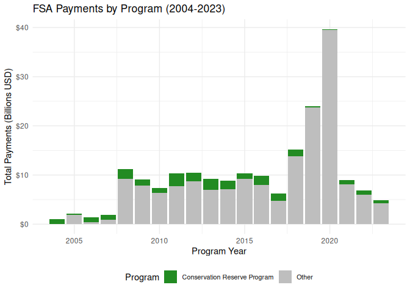
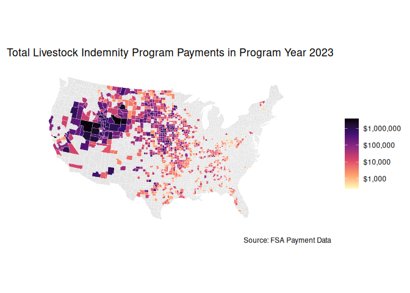
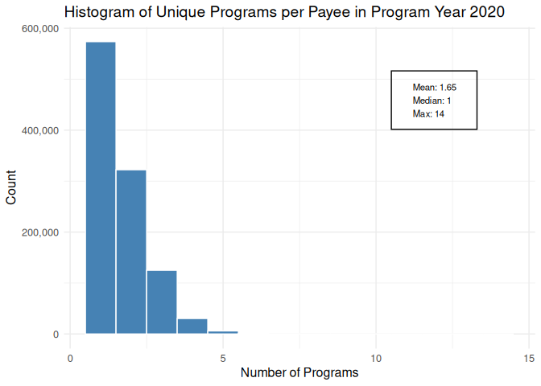

rfsa: A package for accessing and USDA Farm Service Agency data
================

- [Introduction](#introduction)
- [Installation](#installation)
- [Usage](#usage)
- [ARC and PLC Program Data](#arc-and-plc-program-data)
- [FSA Individual Payment Files](#fsa-individual-payment-files)
- [Data Validation Checks](#data-validation-checks)
- [Example Usage](#example-usage)
  - [Plot payments made via the Conservation Reserve Program relative to
    total payments over
    time](#plot-payments-made-via-the-conservation-reserve-program-relative-to-total-payments-over-time)
  - [Plot county level payments made through the livestock indemnity
    program in program year
    2023](#plot-county-level-payments-made-through-the-livestock-indemnity-program-in-program-year-2023)
  - [Plot a histogram showing the number of programs individual payee’s
    recieved payments from in program year
    2020](#plot-a-histogram-showing-the-number-of-programs-individual-payees-recieved-payments-from-in-program-year-2020)

<!-- README.md is generated from README.Rmd. Please edit that file -->

# Introduction

The `rfsa` package provides cleaned and aggregated version of publicly
available data sets related to programs administered by the USDA, Farm
Service Agency.

Disclaimer: This product uses data provided by the USDA, but is not
endorsed by or affiliated with USDA or the Federal Government.

# Installation

`rfsa` can be installed directly from GitHub using
`remotes::install_github("dylan-turner25/rfsa", force = TRUE)`.

# Usage

The`rfsa` package provides several ways to access data depending on the
type of data set. The first way is by loading pre-built data sets using
the `data()` function. For example, to load the `fsaMyaPrice` data set,
use the following code.

``` r
# load the rfsa package
library(rfsa)

# load marketing year average prices
data("fsaMyaPrice")
 
head(fsaMyaPrice)
#> # A tibble: 6 × 15
#>   crop          marketing_year marketing_year_dates publishing_dates_for…¹ unit 
#>   <chr>         <chr>          <chr>                <chr>                  <chr>
#> 1 wheat         2014-2015      Jun. 1-May 31        Jun. 29, 2015          Bush…
#> 2 barley        2014-2015      Jun. 1-May 31        Jun. 29, 2015          Bush…
#> 3 oats          2014-2015      Jun. 1-May 31        Jun. 29, 2015          Bush…
#> 4 peanuts       2014-2015      Aug. 1-Jul. 31       Aug. 31, 2015          Pound
#> 5 corn          2014-2015      Sep. 1-Aug. 31       Sep. 29, 2015          Bush…
#> 6 grain sorghum 2014-2015      Sep. 1-Aug. 31       Sep. 29, 2015          Bush…
#> # ℹ abbreviated name: ¹​publishing_dates_for_final_mya_price
#> # ℹ 10 more variables: current_mya_price <dbl>, final_mya_price_lag1 <dbl>,
#> #   final_mya_price_lag2 <dbl>, final_mya_price_lag3 <dbl>,
#> #   final_mya_price_lag4 <dbl>, final_mya_price_lag5 <dbl>,
#> #   final_mya_price_lag6 <dbl>, rma_crop_code <dbl>, crop_type <chr>,
#> #   rma_type_code <chr>
```

The other way to ob

# ARC and PLC Program Data

The following table reports the currently available data sets related to
ARC and PLC in the `rfsa` package. These data sets are cleaned and
compiled versions of data available on FSA’s [ARC and PLC data landing
page](https://www.fsa.usda.gov/resources/programs/arc-plc/program-data).
Loading a data set is done using the `data` function. For example, to
load the `fsaMyaPrice` data set, use the following code.

``` r
# load the rfsa package
library(rfsa)

# load marketing year average prices
data("fsaMyaPrice")
 
head(fsaMyaPrice)
#> # A tibble: 6 × 15
#>   crop          marketing_year marketing_year_dates publishing_dates_for…¹ unit 
#>   <chr>         <chr>          <chr>                <chr>                  <chr>
#> 1 wheat         2014-2015      Jun. 1-May 31        Jun. 29, 2015          Bush…
#> 2 barley        2014-2015      Jun. 1-May 31        Jun. 29, 2015          Bush…
#> 3 oats          2014-2015      Jun. 1-May 31        Jun. 29, 2015          Bush…
#> 4 peanuts       2014-2015      Aug. 1-Jul. 31       Aug. 31, 2015          Pound
#> 5 corn          2014-2015      Sep. 1-Aug. 31       Sep. 29, 2015          Bush…
#> 6 grain sorghum 2014-2015      Sep. 1-Aug. 31       Sep. 29, 2015          Bush…
#> # ℹ abbreviated name: ¹​publishing_dates_for_final_mya_price
#> # ℹ 10 more variables: current_mya_price <dbl>, final_mya_price_lag1 <dbl>,
#> #   final_mya_price_lag2 <dbl>, final_mya_price_lag3 <dbl>,
#> #   final_mya_price_lag4 <dbl>, final_mya_price_lag5 <dbl>,
#> #   final_mya_price_lag6 <dbl>, rma_crop_code <dbl>, crop_type <chr>,
#> #   rma_type_code <chr>
```

The following table provides some information about the ARC and PLC
specific data sets in the `rfsa` package. The `Last Updated` column
indicates the last time the data set was updated in the package. The
`Data Download Date` indicates the date that the raw input data for the
current year was downloaded from the FSA website (this is important as
these data sets are sometimes revised or contain projected values for in
progress marketing years).

| Dataset | Description | Rows | Years | Last Updated | Data Download Date | Included Columns |
|:---|:---|---:|:---|:---|:---|:---|
| fsaArcCoBenchmarks | ARC-CO Benchmark Data | 163079 | 2014-2023 | 05/05/2025 | 05/05/2025 | fips, state_name, county_name, crop, unit, yield_type, program_year, benchmark_revenue, guarantee_revenue, maximum_payment_rate, actual_yield, national_price, actual_revenue, formula_payment_rate, payment_rate, oa_bench_mark_price, oa_bench_mark_yield, oa_bench_mark_years, arc_co_payment_rate, crop_type, rma_type_code, rma_crop_code |
| fsaArcCoPrice | ARC-CO Benchmark and Actual Price Data | 249 | 2014-2024 | 05/05/2025 | 05/05/2025 | crop, marketing_year_dates, publishing_dates_for_final_mya_price, unit, reference_price_combined, annual_benchmark_price_lag5, annual_benchmark_price_lag4, annual_benchmark_price_lag3, annual_benchmark_price_lag2, annual_benchmark_price_lag1, current_arcco_benchmark_price, current_mya_price, current_national_loan_rate, current_arcco_actual_price, marketing_year, program_year, crop_type, rma_type_code, rma_crop_code |
| fsaArcIcPrice | Commodity-specific ARC-IC benchmark prices, MYA prices, and statutory reference prices. | 227 | 2015-2024 | 05/05/2025 | 05/05/2025 | crop, marketing_year_dates, publishing_dates_for_final_mya_price, unit, reference_price_combined, annual_benchmark_price_lag5, annual_benchmark_price_lag4, annual_benchmark_price_lag3, annual_benchmark_price_lag2, annual_benchmark_price_lag1, current_mya_price, current_national_loan_rate, current_arcic_actual_price, marketing_year, program_year, crop_type, rma_type_code, rma_crop_code |
| fsaArcPlcBaseAcres | ARC/PLC enrolled base acres by commodity | 225 | 2015-2024 | 05/21/2025 | 05/05/2025 | covered_commodity, plc_covered_commodity_contract_base, plc_plantings_attributed_to_generic_base, arc_co_covered_commodity_contract_base, arc_co_plantings_attributed_to_generic_base, arc_ic_enrolled_base_covered_commodity_contract_base, total, plc_total, arc_co_total, arc_ic_total, program_year, arc_co_all, arc_co_irrigated, arc_co_nonirrigated, crop_type, rma_type_code, rma_crop_code, crop |
| fsaArcPlcPayments | ARC/PLC Program Payments by Crop and Year | 481 | 2014-2023 | 05/05/2025 | 05/05/2025 | program, crop, program_year, payments, crop_type, rma_type_code, rma_crop_code |
| fsaCountyBaseAcres | County‐level base acres and average PLC yields by crop | 99308 | 2014-2023 | 05/21/2025 | 05/05/2025 | state, county, state_code, county_code, crop, crop_type, base_acres, avg_plc_yield, program_year, rma_type_code, rma_crop_code, fips |
| fsaEffectiveRefPrices | Effective Reference Prices for ARC/PLC Commodities | 158 | 2019-2025 | 05/05/2025 | 05/05/2025 | crop, marketing_year_dates, marketing_year, program_year, unit, statutory_reference_price, 115_statutory_reference_price, mya_price_lag5, mya_price_lag4, mya_price_lag3, mya_price_lag2, mya_price_lag1, 85_olympic_average_mya, effective_reference_price, crop_type, rma_type_code, rma_crop_code |
| fsaMyaPrice | FSA Marketing Year Average Prices | 245 | 2014-2024 | 05/05/2025 | 05/05/2025 | crop, marketing_year, marketing_year_dates, publishing_dates_for_final_mya_price, unit, current_mya_price, final_mya_price_lag1, final_mya_price_lag2, final_mya_price_lag3, final_mya_price_lag4, final_mya_price_lag5, final_mya_price_lag6, rma_crop_code, crop_type, rma_type_code |
| fsaPlcPaymentRate | Price Loss Coverage (PLC) Payment Rates by Crop and Program Year | 249 | 2014-2024 | 05/05/2025 | 05/05/2025 | crop, marketing_year_dates, marketing_year, program_year, publishing_dates_for_final_mya_price, statutory_reference_price, effective_reference_price, combined_reference_price, unit, current_mya_price, current_national_loan_rate, plc_price, plc_payment_rate, max_plc_payment_rate, crop_type, rma_type_code, rma_crop_code |

# FSA Individual Payment Files

The USDA Farm Service Agency provides access to [individual payment
files](https://www.fsa.usda.gov/tools/informational/freedom-information-act-foia/electronic-reading-room/frequently-requested/payment-files)
that contain payment information for programs administered by FSA. The
data in these files can be accessed using the `get_fsa_payments()`
function. This function pulls data from [pre-cleaned
files](https://github.com/dylan-turner25/rfsa/releases/tag/v0.1.0) that
are stored as GitHub Releases on the `rfsa` GitHub Repository. This
approach minimizes memory overhead and compute time when only a small
portion of the data is needed. The `get_fsa_payments()` function has
several arguments that allow the user to filter the data. The `year`
argument specifies the year of interest (can be a vector of multiple
year), the `program` argument specifies the program of interest (ex:
“ARC-CO”,“ARC-IC”,“PLC”, “CRP”), and the `year_type` argument specifies
whether to pull data that has been aggregated by `program_year`
(i.e. the year corresponding to the event that prompted the payment),
the `fiscal_year` (i.e. the Government fiscal year corresponding to the
payment), or `payment_year` (i.e. the actual calendar year when funds
were disbursed) . The `aggregation` argument specifies whether to
aggregate the data at the `national`,`state`, `county`, or `individual`
level. The first time that a combination of `year`, `program`, and
`year_type` are specified will prompt the relevant files to be
downloaded which will then be cached on your local machine. This means
that depending on the quanity of data needed, the initial query may take
some time, however, subsequent function calls for the same data will be
much quicker. To remove all cached data use `clear_rfsa_cache()`. Below
are several examples of how to use the `get_fsa_payments()` function.

``` r

library(rfsa)

# get national level data on payments made through the conservation reserve program in program year 2023. 
data <- get_fsa_payments(year = 2023, 
                         program = c("CRP"), 
                         year_type = "program", 
                         aggregation = "national")
```

The following table provides a list of all the program abbreviations
that can be passed to the `program` argument in the `get_fsa_payments()`
function. A complete list of every unique accounting description that
occurs in all FSA individual payment files and how each description was
classified into one of the program listed below, see [this
file](https://github.com/dylan-turner25/rfsa/blob/main/data-raw/fsaFarmPayments/supplementary_files/program_details.csv)
(pointing out any suspected incorrect classifications is encouraged!).

| program_abbreviation | program_full_name |
|:---|:---|
| ACRE | Average Crop Revenue Election |
| AILFP | American Indian Livestock Feed Program |
| ARC-CO | Agricultural Risk Coverage-County Coverage |
| ARC-IC | Agricultural Risk Coverage-Individual Coverage |
| BCAP | Biomass Crop Assistance Program |
| CDP | Crop Disaster Program |
| CFAP | Coronavirus Food Assistance Program |
| CGCS | Cotton Ginning Cost Share Program |
| CRP | Conservation Reserve Program |
| CTAP | Cotton Transition Assistance Program |
| DCP | Direct and Counter-Cyclical Program |
| DDAPP | Dairy Disaster Assistance Payment Program |
| DELAP | Dairy Economic Loss Assistance Program |
| DIPP | Dairy Indemnity Payment Program |
| DMC | Dairy Margin Coverage Program |
| DMC | Dairy Indemnity Payment Program |
| ECP | Emergency Conservation Program |
| EFRP | Emergency Forest Restoration Program |
| ELAP | Emergency Livestock Assistance Program |
| ELRP | Emergency Livestock Relief Program |
| ELRRPP | Ewe Lamb Replacement and Retention Payment Program |
| ERP | Emergency Relief Program |
| FHADA | Florida Hurricane Agricultural Disaster Assistance |
| FSFL | Farm Storage Facility Loan Program |
| GO | Graze Out Program |
| GRP | Grasslands Reserve Program |
| HIP | Hurricane Indemnity Program |
| HSDP | Hawaii Sugar Disaster Program |
| Interest-Penalty | Interest Payment |
| LCP | Livestock Compensation Program |
| LDP | Loan Defiency Program |
| LFP | Livestock Forage Program |
| LIP | Livestock Indemnity Program |
| MAL | Market Assistance Loan |
| MFP | Market Facilitation Program |
| MILC | Milk Income Loss Contract Program |
| MLP | Milk Loss Program |
| Other | Other Programs/Vague Accounting Descriptions |
| PLC | Price Loss Coverage |
| ODMAP | Organic Dairy Marketing Assistance Program |
| RPP | Rice Production Program |
| CARES-ACT | CARES-ACT |
| COVID-Unspecified | COVID-Unspecified |
| MAP | Market Access Program |
| PARP | Pandemic Assistance Revenue Program |
| OTECP | Organic and Transitional Education and Certification Program |
| NAP | Non-Insured Crop Disaster Assistance Program |
| OCCSP | Organic Certification Cost Share Program |
| PATHH | Pandemic Assistance for Timber Harvesters and Haulers |
| PLIP | Pandemic Livestock Indemnity Program |
| QLA | Quality Loss Adjustment Program |
| RTCP | Reimbursement Transportation Cost Payment Program for Geographically Disadvantaged Farmers and Ranchers |
| SMHPP | Spot Market Hog Pandemic Program |
| STRP | Seafood Trade Relief Program |
| SURE | Supplemental Revenue Assistance Program |
| TAAF | Trade Adjustment Assistance for Farmers |
| TAP | Tree Assistance Program |
| TIP | Tree Indemnity Program |
| TTPP | Tobacco Transition Payment Program |
| WHIP | Wildfires and Hurricanes Indemnity Program |

# Data Validation Checks

The following table contains data validation checks. These are
comparisons between values derived from the `rfsa` package functions
against the same values obtained from another source. For example, the
first row calculates total ARC-CO payments in program year 2023 using
the `get_fsa_payments()` function and compares it to the total ARC-CO
payments in program year 2023 from an aggregated file on the FSA
website. The `check_passed` column indicates whether the difference
between the two values is less than 1%. If you are reading this and have
a value of interest that you would like to see added to this table,
please open an issue on the GitHub repository with the relevant
information including code to generate the value using the `rfsa`
package as well as an external source to validate the value against.

| value | code | package_value | external_value | external_source | percentage_difference | check_passed |
|:---|:---|---:|---:|:---|:---|:---|
| National ARC-CO payments in program year 2023 | get_fsa_payments(year = 2023,program = c(“ARC-CO”),year_type = “program”,aggregation = “national”)\[,“payment_amount”\] | 460388613 | 461724994 | <https://www.fsa.usda.gov/sites/default/files/2025-01/ARCCO%20Non-ProgYr%20Specific%20Payment%20Data%20%282025-01-06%29.xlsx> | %-0.2894 | <span style=" font-weight: bold;    color: white !important;border-radius: 4px; padding-right: 4px; padding-left: 4px; background-color: forestgreen !important;">✓</span> |
| National ARC-CO payments in program year 2023 | data(fsaArcPlcPayments); fsaArcPlcPayments %\>% filter(program == “ARC-CO”, program_year == 2023) %\>% group_by(program_year) %\>% summarize(payments = sum(payments)) | 461724994 | 461724994 | <https://www.fsa.usda.gov/sites/default/files/2025-01/ARCCO%20Non-ProgYr%20Specific%20Payment%20Data%20%282025-01-06%29.xlsx> | %0 | <span style=" font-weight: bold;    color: white !important;border-radius: 4px; padding-right: 4px; padding-left: 4px; background-color: forestgreen !important;">✓</span> |

# Example Usage

## Plot payments made via the Conservation Reserve Program relative to total payments over time

``` r
library(rfsa)
library(ggplot2)

# note this is aggregating roughly 60 million individual payments behind the scenes
# and takes up roughly 20 GB of memory. A more memory efficient approach would be
# to loop over years and aggregate each year individually to avoid loading all the data into memory at once.
data <- get_fsa_payments(year = 2004:2023,
                         year_type = "program",
                         aggregation = "national")
#> Warning in get_fsa_payments(year = 2004:2023, year_type = "program",
#> aggregation = "national"): NAs introduced by coercion


data %>%
  mutate(program_category = if_else(program_abb %in% c("CRP"),
                                    "Conservation Reserve Program",
                                    "Other")) %>%
  ggplot(aes(x = year, y = payment_amount/1e9, fill = program_category)) +
  geom_bar(stat = "identity") +
  scale_y_continuous(labels = scales::dollar_format()) +
  scale_fill_manual(values = c("Conservation Reserve Program" = "forestgreen",
                               "Other" = "grey")) +
  labs(
    title = "FSA Payments by Program (2004-2023)",
    x = "Program Year",
    y = "Total Payments (Billions USD)",
    fill = "Program"
  ) +
  theme_minimal() +
  theme(legend.position = "bottom",
        legend.text = element_text(size = 8))
```



## Plot county level payments made through the livestock indemnity program in program year 2023

``` r
library(ggplot2)
library(maps)
library(mapproj)
library(dplyr)

data <- get_fsa_payments(year = 2023, 
                         year_type = "program",
                         program = c("LIP"),
                         aggregation = "county") %>%
  mutate(
    state_fips = substr(fips_fsa, 1, 2),
    county_fips = substr(fips_fsa, 3, 5)
  )

# Get county map data
counties <- map_data("county")

# Get state and county names from FIPS codes
fips_codes <- data %>%
  select(fips_fsa, county_name_fsa) %>%
  distinct() %>%
  mutate(
    state = state.fips$polyname[match(state_cd_fsa, state.fips$fips)],
    county = tolower(county_name_fsa)
  )
#> Adding missing grouping variables: `state_cd_fsa`, `county_cd_fsa`, `year`,
#> `program_abb`

# Join payment data with map data
map_data <- counties %>%
  left_join(
    data %>%
      left_join(fips_codes, by = "fips_fsa") %>%
      select(state, county, payment_amount),
    by = c("region" = "state", "subregion" = "county")
  )
#> Adding missing grouping variables: `fips_fsa`


# Create the map
ggplot(map_data, aes(x = long, y = lat, group = group, fill = payment_amount)) +
geom_polygon(color = "white", size = 0.1) +
coord_map("albers", lat0 = 30, lat1 = 40) +
scale_fill_viridis_c(
  option = "magma",
  name = "",
  trans = "log10",
  labels = scales::dollar_format(),
  na.value = "grey90",
  direction = -1
) +
labs(
  title = "Total Livestock Indemnity Program Payments in Program Year 2023",
  caption = "Source: FSA Payment Data"
) +
theme_minimal() +
theme(
  axis.text = element_blank(),
  axis.title = element_blank(),
  panel.grid = element_blank()
)
#> Warning: Using `size` aesthetic for lines was deprecated in ggplot2 3.4.0.
#> ℹ Please use `linewidth` instead.
#> This warning is displayed once every 8 hours.
#> Call `lifecycle::last_lifecycle_warnings()` to see where this warning was
#> generated.
```



## Plot a histogram showing the number of programs individual payee’s recieved payments from in program year 2020

``` r
library(rfsa)
library(dplyr)
library(ggplot2)

data <- get_fsa_payments(year = 2020,
                         year_type = "program",
                         aggregation = "individual") %>%
  group_by(name_payee) %>%
  summarise(unique_programs = n_distinct(program_abb))


ggplot(data, aes(x = unique_programs)) +
  geom_histogram(binwidth = 1, fill = "steelblue", color = "white") +
  labs(title = "Histogram of Unique Programs per Payee in Program Year 2020",
       x = "Number of Programs",
       y = "Count") +
  theme_minimal() +
  scale_y_continuous(labels = scales::comma) +
  scale_x_continuous(breaks = scales::pretty_breaks()) +
  annotate("text", x = max(data$unique_programs) * 0.8, y = max(table(data$unique_programs)) * 0.8,
           label = paste("Mean:", round(mean(data$unique_programs), 2),
                         "\nMedian:", median(data$unique_programs),
                         "\nMax:", max(data$unique_programs)),
           hjust = 0, size = 3,
           family = "sans") +
  annotate("rect", 
           xmin = max(data$unique_programs) * 0.75, 
           xmax = max(data$unique_programs) * 0.95,
           ymin = max(table(data$unique_programs)) * 0.7,
           ymax = max(table(data$unique_programs)) * 0.9,
           alpha = 0, fill = "white",
           color = "black", linewidth = 0.5) +
  theme(text = element_text(size = 12))
```


