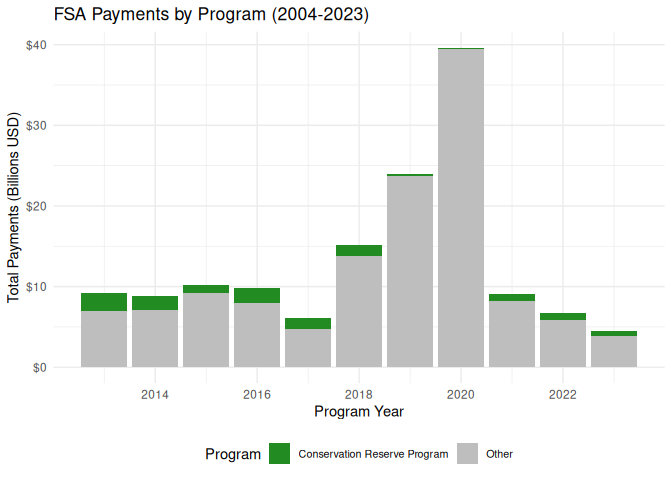
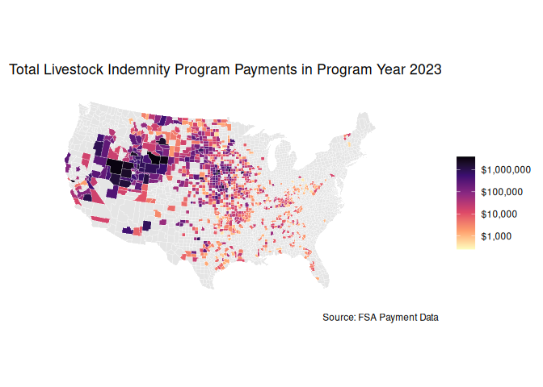
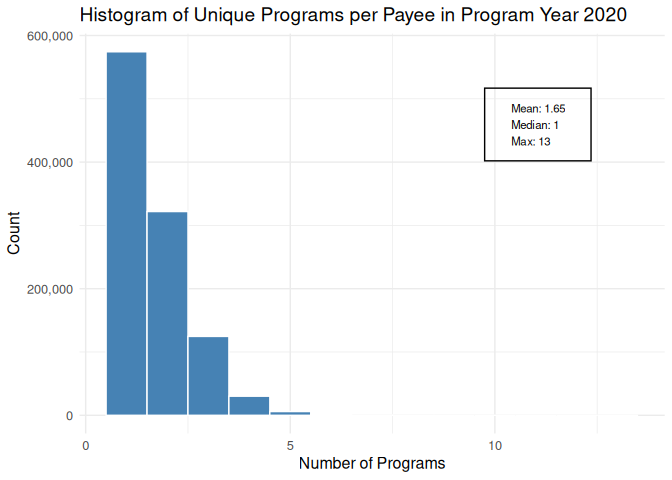
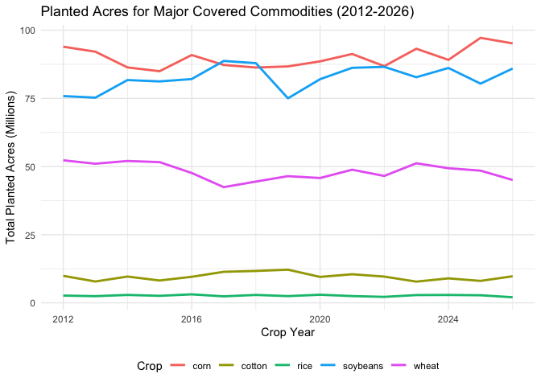
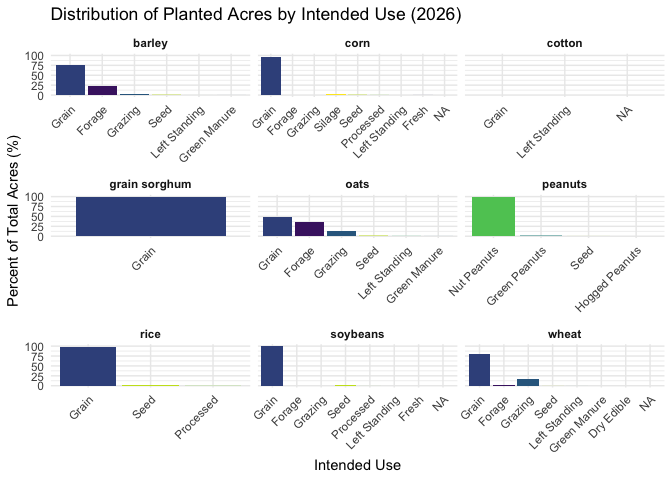

rfsa: A package for accessing USDA Farm Service Agency data
================

- [Introduction](#introduction)
- [Installation](#installation)
- [ARC and PLC Program Data](#arc-and-plc-program-data)
  - [PLC Payment Calculations](#plc-payment-calculations)
  - [ARC-CO Payment Calculations](#arc-co-payment-calculations)
- [FSA Individual Payment Files](#fsa-individual-payment-files)
- [Data Validation Checks](#data-validation-checks)
- [Example Usage](#example-usage)
  - [Plot payments made via the Conservation Reserve Program relative to
    total payments over
    time](#plot-payments-made-via-the-conservation-reserve-program-relative-to-total-payments-over-time)
  - [Plot county level payments made through the livestock indemnity
    program in program year
    2023](#plot-county-level-payments-made-through-the-livestock-indemnity-program-in-program-year-2023)
  - [Plot a histogram showing the number of programs individual payee’s
    recieved payments from in program year
    2020](#plot-a-histogram-showing-the-number-of-programs-individual-payees-recieved-payments-from-in-program-year-2020)
- [FSA Crop Acreage Data](#fsa-crop-acreage-data)
  - [Dataset Overview](#dataset-overview)
  - [Loading and Using the Data](#loading-and-using-the-data)
  - [Example: Analyze Corn Planted Acres by Irrigation
    Practice](#example-analyze-corn-planted-acres-by-irrigation-practice)
  - [Example: Plot Planted Acres Over
    Time](#example-plot-planted-acres-over-time)
  - [Example: Analyze Oats by Intended
    Use](#example-analyze-oats-by-intended-use)
  - [Example: Plot Intended Use Distribution Across Multiple
    Crops](#example-plot-intended-use-distribution-across-multiple-crops)
  - [Additional Crop Acreage
    Datasets](#additional-crop-acreage-datasets)

<!-- README.md is generated from README.Rmd. Please edit that file -->

# Introduction

The `rfsa` package provides cleaned and aggregated version of publicly
available data sets related to programs administered by the USDA, Farm
Service Agency.

Disclaimer: This product uses data provided by the USDA, but is not
endorsed by or affiliated with USDA or the Federal Government.

If you find this package to be helpful in your research, consider citing
it:

``` r
citation("rfsa")
#> To cite rfsa in publications use:
#> 
#>   Turner D (2025). rfsa: Data on programs administered by the USDA,
#>   Farm Service Agency. R package version 0.0.0.9000.
#> 
#> A BibTeX entry for LaTeX users is
#> 
#>   @Manual{,
#>     title = {rfsa: Data on programs administered by the USDA, Farm Service Agency},
#>     author = {Dylan Turner},
#>     year = {2025},
#>     version = {0.0.0.9000},
#>   }
```

# Installation

`rfsa` can be installed directly from GitHub using
`remotes::install_github("dylan-turner25/rfsa", force = TRUE)`.

# ARC and PLC Program Data

The following table reports the currently available data sets related to
ARC and PLC in the `rfsa` package. These data sets are cleaned and
compiled versions of data available on FSA’s [ARC and PLC data landing
page](https://www.fsa.usda.gov/resources/programs/arc-plc/program-data).
Loading a data set is done using the `data` function. For example, to
load the `fsaMyaPrice` data set, use the following code.

``` r
# load the rfsa package
library(rfsa)

# load marketing year average prices
data("fsaMyaPrice")
 
head(fsaMyaPrice)
#> # A tibble: 6 × 15
#>   crop          marketing_year marketing_year_dates publishing_dates_for…¹ unit 
#>   <chr>         <chr>          <chr>                <chr>                  <chr>
#> 1 wheat         2014-2015      Jun. 1-May 31        Jun. 29, 2015          Bush…
#> 2 barley        2014-2015      Jun. 1-May 31        Jun. 29, 2015          Bush…
#> 3 oats          2014-2015      Jun. 1-May 31        Jun. 29, 2015          Bush…
#> 4 peanuts       2014-2015      Aug. 1-Jul. 31       Aug. 31, 2015          Pound
#> 5 corn          2014-2015      Sep. 1-Aug. 31       Sep. 29, 2015          Bush…
#> 6 grain sorghum 2014-2015      Sep. 1-Aug. 31       Sep. 29, 2015          Bush…
#> # ℹ abbreviated name: ¹​publishing_dates_for_final_mya_price
#> # ℹ 10 more variables: current_mya_price <dbl>, final_mya_price_lag1 <dbl>,
#> #   final_mya_price_lag2 <dbl>, final_mya_price_lag3 <dbl>,
#> #   final_mya_price_lag4 <dbl>, final_mya_price_lag5 <dbl>,
#> #   final_mya_price_lag6 <dbl>, rma_crop_code <dbl>, crop_type <chr>,
#> #   rma_type_code <chr>
```

The following table provides some information about the ARC and PLC
specific data sets in the `rfsa` package. The `Last Updated` column
indicates the last time the data set was updated in the package. The
`Data Download Date` indicates the date that the raw input data for the
current year was downloaded from the FSA website (this is important as
these data sets are sometimes revised or contain projected values for in
progress marketing years).

| Dataset | Description | Rows | Years | Last Updated | Data Download Date | Included Columns |
|:---|:---|---:|:---|:---|:---|:---|
| fsaArcCoBenchmarks | ARC-CO Benchmark Data | 404626 | 2014-2025 | 08/28/2025 | 08/26/2025 | fips, state_name, county_name, crop, unit, yield_type, program_year, oa_bench_mark_years, rma_crop_code, rma_type_code, crop_type, county_yield_type, benchmark_revenue, guarantee_revenue, maximum_payment_rate, actual_yield, national_price, actual_revenue, formula_payment_rate, payment_rate, oa_bench_mark_price, oa_bench_mark_yield |
| fsaArcCoPrice | ARC-CO Benchmark and Actual Price Data | 272 | 2014-2025 | 08/28/2025 | 08/28/2025 | crop, marketing_year_dates, publishing_dates_for_final_mya_price, unit, reference_price_combined, annual_benchmark_price_lag5, annual_benchmark_price_lag4, annual_benchmark_price_lag3, annual_benchmark_price_lag2, annual_benchmark_price_lag1, current_arcco_benchmark_price, current_mya_price, current_national_loan_rate, current_arcco_actual_price, marketing_year, program_year, crop_type, rma_type_code, rma_crop_code |
| fsaArcIcPrice | Commodity-specific ARC-IC benchmark prices, MYA prices, and statutory reference prices. | 227 | 2015-2024 | 05/05/2025 | 05/05/2025 | crop, marketing_year_dates, publishing_dates_for_final_mya_price, unit, reference_price_combined, annual_benchmark_price_lag5, annual_benchmark_price_lag4, annual_benchmark_price_lag3, annual_benchmark_price_lag2, annual_benchmark_price_lag1, current_mya_price, current_national_loan_rate, current_arcic_actual_price, marketing_year, program_year, crop_type, rma_type_code, rma_crop_code |
| fsaArcPlcBaseAcres | ARC/PLC enrolled base acres by commodity | 225 | 2015-2024 | 05/21/2025 | 05/05/2025 | covered_commodity, plc_covered_commodity_contract_base, plc_plantings_attributed_to_generic_base, arc_co_covered_commodity_contract_base, arc_co_plantings_attributed_to_generic_base, arc_ic_enrolled_base_covered_commodity_contract_base, total, plc_total, arc_co_total, arc_ic_total, program_year, arc_co_all, arc_co_irrigated, arc_co_nonirrigated, crop_type, rma_type_code, rma_crop_code, crop |
| fsaArcPlcData | Comprehensive ARC/PLC Payment Analysis Dataset | 1288552 | 2014-2025 | 12/01/2025 | 05/05/2025 | fips, state_name, crop, crop_type, program_year, county_name, unit, yield_type, oa_bench_mark_years, rma_crop_code, rma_type_code, county_yield_type, benchmark_revenue, guarantee_revenue, maximum_payment_rate, actual_yield, national_price, actual_revenue, formula_payment_rate, payment_rate, oa_bench_mark_price, oa_bench_mark_yield, marketing_year, plc_yield, annual_benchmark_price_lag5, annual_benchmark_price_lag4, annual_benchmark_price_lag3, annual_benchmark_price_lag2, annual_benchmark_price_lag1, current_arcco_benchmark_price, current_national_loan_rate, current_mya_price, final_mya_price_lag1, final_mya_price_lag2, final_mya_price_lag3, final_mya_price_lag4, final_mya_price_lag5, final_mya_price_lag6, statutory_reference_price, effective_reference_price, erp_calc, erp_calc_check, oa_bench_mark_price_calc, base_acres, enrolled_base_ARCCO, enrolled_base_PLC, planted_irrigated_share, planted_non_irrigated_share, planted_irrigated_share_national, planted_non_irrigated_share_national, planted_and_failed_acres, prevented_acres, planted_acres, failed_acres, nass_yield_national, nass_yield_state, yield_imputed, imputation_method, nass_pct_change_applied, actual_yield_5yr_avg, nass_5yr_avg, years_used_in_avg, rma_yield_amount, rma_trended_yield, rma_detrended_yield, rma_practice_count |
| fsaArcPlcPayments | ARC/PLC Program Payments by Crop and Year | 481 | 2014-2023 | 05/05/2025 | 05/05/2025 | program, crop, program_year, payments, crop_type, rma_type_code, rma_crop_code |
| fsaCountyBaseAcres | County‐level base acres and average PLC yields by crop | 99307 | 2014-2023 | 08/25/2025 | 05/05/2025 | state, county, state_code, county_code, crop, crop_type, base_acres, avg_plc_yield, program_year, rma_type_code, rma_crop_code, fips |
| fsaCoveredCommodityShares | County-Level Covered Commodity Shares | 39767 | Inf–Inf | 12/16/2025 | 05/05/2025 | crop_yr, state_cd, county_cd, fips, total_planted_acres, cc_planted_acres, cc_planted_share |
| fsaCropAcreage | FSA County-Level Crop Acreage Data - All Crops | 3223484 | Inf–Inf | 12/16/2025 | 05/05/2025 | state_cd, county_cd, crop_cd, state, county, fips, crop, fsa_crop_type, intended_use, irrigation_practice, planted_acres, volunteer_acres, failed_acres, prevented_acres, not_planted_acres, planted_and_failed_acres, crop_yr, release_date, release_month, release_yr, release_day, current_release, covered_commodity |
| fsaCropAcreageCC | FSA County-Level Crop Acreage Data - Covered Commodities Only | 538946 | Inf–Inf | 12/16/2025 | 05/05/2025 | fips, state, county, crop, crop_type, irrigation_practice, crop_yr, intended_use, planted_acres, volunteer_acres, failed_acres, prevented_acres, not_planted_acres, planted_and_failed_acres, rma_crop_code, rma_type_code |
| fsaEffectiveRefPrices | Effective Reference Prices for ARC/PLC Commodities | 161 | 2019-2025 | 07/05/2025 | 05/05/2025 | crop, marketing_year_dates, marketing_year, program_year, unit, statutory_reference_price, 115_statutory_reference_price, mya_price_lag5, mya_price_lag4, mya_price_lag3, mya_price_lag2, mya_price_lag1, 85_olympic_average_mya, effective_reference_price, crop_type, rma_type_code, rma_crop_code |
| fsaEnrolledCountyBaseAcres | County-level enrolled base acres by program and commodity | 100489 | 2019-2025 | 08/27/2025 | 08/27/2025 | fips, state, county, crop, program_year, crop_type, rma_type_code, rma_crop_code, enrolled_base_ARCCO, enrolled_base_PLC |
| fsaMyaPrice | FSA Marketing Year Average Prices | 272 | 2014-2025 | 11/17/2025 | 11/17/2025 | crop, marketing_year, marketing_year_dates, publishing_dates_for_final_mya_price, unit, current_mya_price, final_mya_price_lag1, final_mya_price_lag2, final_mya_price_lag3, final_mya_price_lag4, final_mya_price_lag5, final_mya_price_lag6, rma_crop_code, crop_type, rma_type_code |
| fsaPlcPaymentRate | Price Loss Coverage (PLC) Payment Rates by Crop and Program Year | 249 | 2014-2024 | 07/05/2025 | 05/05/2025 | crop, marketing_year_dates, marketing_year, program_year, publishing_dates_for_final_mya_price, statutory_reference_price, effective_reference_price, combined_reference_price, unit, current_mya_price, current_national_loan_rate, plc_price, plc_payment_rate, max_plc_payment_rate, crop_type, rma_type_code, rma_crop_code |
| fsaPlcYields | County-level PLC yields by commodity and program year | 152375 | 2018-2025 | 07/14/2025 | 06/24/2025 | fips, state, county, crop, crop_type, plc_yield, plc_yield_units, enrolled_base, program_year, crop_year, rma_crop_code, rma_type_code |

## PLC Payment Calculations

The `rfsa` package includes the `calc_plc_payment()` function for
calculating Price Loss Coverage payments. Custom values for the various
prices, percentages, yields, and other parameters can be specified, or
the function can use default values based on the ARC and PLC data
described above. The function requires a minimum of the `crop` and
`program_year` arguments to be specified. If no other arguments are
specified, the returned value will be the PLC payment for 1 base acre
based on the national average of county level PLC yields (available in
the `fsaPLcYields` data set).

``` r
# Calculate PLC payment for 1 base acre of corn in 2024 (based on national average of county level PLC yields).
payment <- calc_plc_payment(
  crop = "corn",
  program_year = 2019
)
#> Warning in calc_plc_payment(crop = "corn", program_year = 2019): No base acres
#> supplied. Defaulting to 1 base acre.
#> Warning in get_plc_yield(crop = crop, program_year = program_year, crop_type =
#> crop_type, : No PLC yield or location parameters supplied. Using national
#> average PLC yield for calculations.

print(paste("PLC payment:", round(payment, 2)))
#> [1] "PLC payment: 12.63"
```

<!-- For further details and examples of the `calc_plc_payment()` function, see the [PLC Payment Calculations vignette](https://github.com/dylan-turner25/rfsa/blob/main/inst/doc/plc-payment-calculations.html). -->

## ARC-CO Payment Calculations

The `rfsa` package includes the `calc_arcco_payment()` function for
calculating Agriculture Risk Coverage County Option (ARC-CO) payments.
Similar to the PLC function, custom values for various prices, yields,
and other parameters can be specified, or the function can use default
values based on the ARC and PLC data described above. The function
requires a minimum of the `crop` and `program_year` arguments to be
specified. If no other arguments are specified, the returned value will
be the ARC-CO payment for 1 base acre based on county-level data (if
location is specified) or national averages.

The following example leaves many of the parameters empty, which will
generate a handful of warnings letting you know what types of
assumptions and average values are used to generate a value.

``` r
# Calculate ARC-CO payment for 1 base acre of corn in 2023 (requires location)
payment <- calc_arcco_payment(
  crop = "corn",
  program_year = 2023,
  fips = 17001  # Adams County, Illinois
)
#> Warning in calc_arcco_payment(crop = "corn", program_year = 2023, fips =
#> 17001): No base acres supplied. Defaulting to 1 base acre.
#> Warning in get_arcco_benchmarks(crop = crop, program_year = program_year, : No
#> ARC-CO yield supplied. Using county average ARC-CO benchmark yield for
#> calculations.
#> Warning in get_arcco_benchmarks(crop = crop, program_year = program_year, : No
#> crop type or yield type supplied, taking the average ARC-CO benchmark yield
#> across all types for corn
#> Warning in get_arcco_benchmarks(crop = crop, program_year = program_year, : No
#> ARC-CO price supplied. Using county average ARC-CO benchmark price for
#> calculations.
#> Warning in get_arcco_benchmarks(crop = crop, program_year = program_year, : No
#> crop type or yield type supplied, taking the average ARC-CO benchmark price
#> across all types for corn
#> Warning in get_arcco_actual_revenue(crop = crop, program_year = program_year, :
#> No actual yield supplied. Using county actual yield for ARC-CO revenue
#> calculations.
#> Warning in get_arcco_actual_revenue(crop = crop, program_year = program_year, :
#> No crop type or yield type supplied, taking the average actual yield across all
#> types for corn

print(paste("ARC-CO payment:", round(payment, 2)))
#> [1] "ARC-CO payment: 0"
```

<!-- For large-scale calculations, the package also provides `calc_arcco_payment_vectorized()` which offers significantly improved performance for batch processing multiple records simultaneously. -->

# FSA Individual Payment Files

The USDA Farm Service Agency provides access to [individual payment
files](https://www.fsa.usda.gov/tools/informational/freedom-information-act-foia/electronic-reading-room/frequently-requested/payment-files)
that contain payment information for programs administered by FSA. The
data in these files can be accessed using the `get_fsa_payments()`
function. This function pulls data from [pre-cleaned
files](https://github.com/dylan-turner25/rfsa/releases/tag/v0.1.0) that
are stored as GitHub Releases on the `rfsa` GitHub Repository. This
approach minimizes memory overhead and compute time when only a small
portion of the data is needed. The `get_fsa_payments()` function has
several arguments that allow the user to filter the data. The `year`
argument specifies the year of interest (can be a vector of multiple
year), the `program` argument specifies the program of interest (ex:
“ARC-CO”,“ARC-IC”,“PLC”, “CRP”), and the `year_type` argument specifies
whether to pull data that has been aggregated by `program_year`
(i.e. the year corresponding to the event that prompted the payment),
the `fiscal_year` (i.e. the Government fiscal year corresponding to the
payment), or `payment_year` (i.e. the actual calendar year when funds
were disbursed) . The `aggregation` argument specifies whether to
aggregate the data at the `national`,`state`, `county`, or `individual`
level. The first time that a combination of `year`, `program`, and
`year_type` are specified will prompt the relevant files to be
downloaded which will then be cached on your local machine. This means
that depending on the quanity of data needed, the initial query may take
some time, however, subsequent function calls for the same data will be
much quicker. To remove all cached data use `clear_rfsa_cache()`. Below
are several examples of how to use the `get_fsa_payments()` function.

``` r

library(rfsa)

# get national level data on payments made through the conservation reserve program in program year 2023. 
data <- get_fsa_payments(year = 2023, 
                         program = c("CRP"), 
                         year_type = "program", 
                         aggregation = "national")
```

The following table provides a list of all the program abbreviations
that can be passed to the `program` argument in the `get_fsa_payments()`
function. A complete list of every unique accounting description that
occurs in all FSA individual payment files and how each description was
classified into one of the program listed below, see [this
file](https://github.com/dylan-turner25/rfsa/blob/main/data-raw/fsaFarmPayments/supplementary_files/program_details.csv)
(pointing out any suspected incorrect classifications is encouraged!).

| program_abbreviation | program_full_name |
|:---|:---|
| ACRE | Average Crop Revenue Election |
| AILFP | American Indian Livestock Feed Program |
| ARC-CO | Agricultural Risk Coverage-County Coverage |
| ARC-IC | Agricultural Risk Coverage-Individual Coverage |
| BCAP | Biomass Crop Assistance Program |
| CARES-ACT | CARES-ACT |
| CDP | Crop Disaster Program |
| CFAP | Coronavirus Food Assistance Program |
| CGCS | Cotton Ginning Cost Share Program |
| COVID-Unspecified | COVID-Unspecified |
| CRP | Conservation Reserve Program |
| CTAP | Cotton Transition Assistance Program |
| DCP | Direct and Counter-Cyclical Program |
| DDAPP | Dairy Disaster Assistance Payment Program |
| DELAP | Dairy Economic Loss Assistance Program |
| DIPP | Dairy Indemnity Payment Program |
| DMC | Dairy Margin Coverage Program |
| ECP | Emergency Conservation Program |
| EFRP | Emergency Forest Restoration Program |
| LAP | Livestock Assistance Program |
| ELAP | Emergency Assistance for Livestock, Honeybees, and Farm-Raised Fish |
| ELRP | Emergency Livestock Relief Program |
| ELRRPP | Ewe Lamb Replacement and Retention Payment Program |
| ERP | Emergency Relief Program |
| FSFL | Farm Storage Facility Loan Program |
| GO | Graze Out Program |
| GRP | Grasslands Reserve Program |
| HIP | Hurricane Indemnity Program |
| HSDP | Hawaii Sugar Disaster Program |
| Interest-Penalty | Interest Payment |
| LCP | Livestock Compensation Program |
| LDP | Loan Defiency Program |
| LFP | Livestock Forage Program |
| LIP | Livestock Indemnity Program |
| MAL | Market Assistance Loan |
| MAP | Market Access Program |
| MFP | Market Facilitation Program |
| MILC | Milk Income Loss Contract Program |
| MLP | Milk Loss Program |
| NAP | Non-Insured Crop Disaster Assistance Program |
| OCCSP | Organic Certification Cost Share Program |
| ODMAP | Organic Dairy Marketing Assistance Program |
| OTECP | Organic and Transitional Education and Certification Program |
| Other | Other Programs |
| PARP | Pandemic Assistance Revenue Program |
| PATHH | Pandemic Assistance for Timber Harvesters and Haulers |
| PLC | Price Loss Coverage |
| PLIP | Pandemic Livestock Indemnity Program |
| QLA | Quality Loss Adjustment Program |
| RPP | Rice Production Program |
| RTCP | Reimbursement Transportation Cost Payment Program for Geographically Disadvantaged Farmers and Ranchers |
| SMHPP | Spot Market Hog Pandemic Program |
| STRP | Seafood Trade Relief Program |
| SURE | Supplemental Revenue Assistance Program |
| TAAF | Trade Adjustment Assistance for Farmers |
| TAP | Tree Assistance Program |
| TIP | Tree Indemnity Program |
| TTPP | Tobacco Transition Payment Program |
| WHIP | Wildfires and Hurricanes Indemnity Program |

# Data Validation Checks

The following table contains data validation checks. These are
comparisons between values derived from the `rfsa` package functions
against the same values obtained from another source. For example, the
first row calculates total ARC-CO payments in program year 2023 using
the `get_fsa_payments()` function and compares it to the total ARC-CO
payments in program year 2023 from an aggregated file on the FSA
website. The `check_passed` column indicates whether the difference
between the two values is less than 1%. If you are reading this and have
a value of interest that you would like to see added to this table,
please open an issue on the GitHub repository with the relevant
information including code to generate the value using the `rfsa`
package as well as an external source to validate the value against.

| value | code | package_value | external_value | external_source | percentage_difference | check_passed |
|:---|:---|---:|---:|:---|:---|:---|
| National ARC-CO payments in program year 2023 | get_fsa_payments(year = 2023,program = c(“ARC-CO”),year_type = “program”,aggregation = “national”)\[,“payment_amount”\] | 460388613 | 461724994 | <https://www.fsa.usda.gov/sites/default/files/2025-01/ARCCO%20Non-ProgYr%20Specific%20Payment%20Data%20%282025-01-06%29.xlsx> | %-0.2894 | <span style=" font-weight: bold;    color: white !important;border-radius: 4px; padding-right: 4px; padding-left: 4px; background-color: forestgreen !important;">✓</span> |
| National ARC-CO payments in program year 2023 | data(fsaArcPlcPayments); fsaArcPlcPayments %\>% filter(program == “ARC-CO”, program_year == 2023) %\>% group_by(program_year) %\>% summarize(payments = sum(payments)) | 461724994 | 461724994 | <https://www.fsa.usda.gov/sites/default/files/2025-01/ARCCO%20Non-ProgYr%20Specific%20Payment%20Data%20%282025-01-06%29.xlsx> | %0 | <span style=" font-weight: bold;    color: white !important;border-radius: 4px; padding-right: 4px; padding-left: 4px; background-color: forestgreen !important;">✓</span> |

# Example Usage

## Plot payments made via the Conservation Reserve Program relative to total payments over time

``` r
library(rfsa)
library(ggplot2)

# note this is aggregating millions individual payments behind the scenes. A more memory efficient approach would be to loop over years and aggregate each year individually to avoid loading all the data into memory at once.
data <- get_fsa_payments(year = 2013:2023,
                         year_type = "program",
                         aggregation = "national")


data %>%
  mutate(program_category = if_else(program_abb %in% c("CRP"),
                                    "Conservation Reserve Program",
                                    "Other")) %>%
  ggplot(aes(x = year, y = payment_amount/1e9, fill = program_category)) +
  geom_bar(stat = "identity") +
  scale_y_continuous(labels = scales::dollar_format()) +
  scale_fill_manual(values = c("Conservation Reserve Program" = "forestgreen",
                               "Other" = "grey")) +
  labs(
    title = "FSA Payments by Program (2004-2023)",
    x = "Program Year",
    y = "Total Payments (Billions USD)",
    fill = "Program"
  ) +
  theme_minimal() +
  theme(legend.position = "bottom",
        legend.text = element_text(size = 8))
```



## Plot county level payments made through the livestock indemnity program in program year 2023

``` r
library(ggplot2)
library(maps)
library(mapproj)
library(dplyr)

data <- get_fsa_payments(year = 2023,
                         year_type = "program",
                         program = c("LIP"),
                         aggregation = "county") %>%
  mutate(
    state_fips = substr(fips_fsa, 1, 2),
    county_fips = substr(fips_fsa, 3, 5)
  )

# Get county map data
counties <- map_data("county")

# Get state and county names from FIPS codes
fips_codes <- data %>%
  select(fips_fsa, county_name_fsa) %>%
  distinct() %>%
  mutate(
    state = state.fips$polyname[match(state_cd_fsa, state.fips$fips)],
    county = tolower(county_name_fsa)
  )
#> Adding missing grouping variables: `state_cd_fsa`, `county_cd_fsa`, `year`,
#> `program_abb`

# Join payment data with map data
map_data <- counties %>%
  left_join(
    data %>%
      left_join(fips_codes, by = "fips_fsa") %>%
      select(state, county, payment_amount),
    by = c("region" = "state", "subregion" = "county")
  )
#> Adding missing grouping variables: `fips_fsa`


# Create the map
ggplot(map_data, aes(x = long, y = lat, group = group, fill = payment_amount)) +
geom_polygon(color = "white", size = 0.1) +
coord_map("albers", lat0 = 30, lat1 = 40) +
scale_fill_viridis_c(
  option = "magma",
  name = "",
  trans = "log10",
  labels = scales::dollar_format(),
  na.value = "grey90",
  direction = -1
) +
labs(
  title = "Total Livestock Indemnity Program Payments in Program Year 2023",
  caption = "Source: FSA Payment Data"
) +
theme_minimal() +
theme(
  axis.text = element_blank(),
  axis.title = element_blank(),
  panel.grid = element_blank()
)
#> Warning: Using `size` aesthetic for lines was deprecated in ggplot2 3.4.0.
#> ℹ Please use `linewidth` instead.
#> This warning is displayed once every 8 hours.
#> Call `lifecycle::last_lifecycle_warnings()` to see where this warning was
#> generated.
```



## Plot a histogram showing the number of programs individual payee’s recieved payments from in program year 2020

``` r
library(rfsa)
library(dplyr)
library(ggplot2)

data <- get_fsa_payments(year = 2020,
                         year_type = "program",
                         aggregation = "individual") %>%
  group_by(name_payee) %>%
  summarise(unique_programs = n_distinct(program_abb))


ggplot(data, aes(x = unique_programs)) +
  geom_histogram(binwidth = 1, fill = "steelblue", color = "white") +
  labs(title = "Histogram of Unique Programs per Payee in Program Year 2020",
       x = "Number of Programs",
       y = "Count") +
  theme_minimal() +
  scale_y_continuous(labels = scales::comma) +
  scale_x_continuous(breaks = scales::pretty_breaks()) +
  annotate("text", x = max(data$unique_programs) * 0.8, y = max(table(data$unique_programs)) * 0.8,
           label = paste("Mean:", round(mean(data$unique_programs), 2),
                         "\nMedian:", median(data$unique_programs),
                         "\nMax:", max(data$unique_programs)),
           hjust = 0, size = 3,
           family = "sans") +
  annotate("rect",
           xmin = max(data$unique_programs) * 0.75,
           xmax = max(data$unique_programs) * 0.95,
           ymin = max(table(data$unique_programs)) * 0.7,
           ymax = max(table(data$unique_programs)) * 0.9,
           alpha = 0, fill = "white",
           color = "black", linewidth = 0.5) +
  theme(text = element_text(size = 12))
```



# FSA Crop Acreage Data

The `rfsa` package includes the `fsaCropAcreageCC` dataset, which
contains county-level planted acreage data for covered commodities
eligible for FSA programs such as ARC and PLC. This dataset is compiled
from FSA’s publicly available [crop acreage
data](https://www.fsa.usda.gov/tools/informational/freedom-information-act-foia/electronic-reading-room/frequently-requested/crop-acreage-data)
and has been cleaned for easy analysis and merging with other FSA
datasets.

## Dataset Overview

The dataset includes:

- **391,596 observations** across **2,937 counties**
- **20 covered commodities** (barley, canola, chickpeas, corn, cotton,
  crambe, dry peas, flaxseed, grain sorghum, lentils, mustard, oats,
  peanuts, rapeseed, rice, safflower, sesame, soybeans, sunflower,
  wheat)
- **Years: 2013-2025**
- Separated by irrigation practice (irrigated vs non-irrigated)
- Crop subtypes where applicable (rice varieties, cotton types, chickpea
  sizes)
- Intended use categories (e.g., grain, silage, grazing, dry edible)

## Loading and Using the Data

``` r
# Load the crop acreage dataset
data("fsaCropAcreageCC")

# View structure
head(fsaCropAcreageCC)
#> # A tibble: 6 × 16
#>    fips state   county  crop  crop_type irrigation_practice crop_yr intended_use
#>   <dbl> <chr>   <chr>   <chr> <chr>     <chr>                 <dbl> <chr>       
#> 1  1001 Alabama Autauga cano… <NA>      N                      2015 Processed   
#> 2  1001 Alabama Autauga cano… <NA>      N                      2016 Processed   
#> 3  1001 Alabama Autauga cano… <NA>      N                      2017 Processed   
#> 4  1001 Alabama Autauga corn  <NA>      I                      2013 Grain       
#> 5  1001 Alabama Autauga corn  <NA>      I                      2014 Forage      
#> 6  1001 Alabama Autauga corn  <NA>      I                      2014 Grain       
#> # ℹ 8 more variables: planted_acres <dbl>, volunteer_acres <dbl>,
#> #   failed_acres <dbl>, prevented_acres <dbl>, not_planted_acres <dbl>,
#> #   planted_and_failed_acres <dbl>, rma_crop_code <dbl>, rma_type_code <chr>

# Get summary of available crops
unique(fsaCropAcreageCC$crop)
#>  [1] "canola"        "corn"          "cotton"        "grain sorghum"
#>  [5] "millet"        "oats"          "peanuts"       "rapeseed"     
#>  [9] "rye"           "sesame"        "soybeans"      "sunflower"    
#> [13] "triticale"     "wheat"         "alfalfa"       "rice"         
#> [17] "dry peas"      "barley"        "dry beans"     "chickpeas"    
#> [21] "mustard"       "safflower"     "flaxseed"      "lentils"      
#> [25] "crambe"
```

## Example: Analyze Corn Planted Acres by Irrigation Practice

``` r
library(dplyr)

# Filter to corn in 2024
corn_2024 <- fsaCropAcreageCC %>%
  filter(crop == "corn", crop_yr == 2024) %>%
  group_by(irrigation_practice) %>%
  summarize(
    total_planted = sum(planted_acres, na.rm = TRUE),
    counties = n_distinct(fips)
  )

print(corn_2024)
#> # A tibble: 2 × 3
#>   irrigation_practice total_planted counties
#>   <chr>                       <dbl>    <int>
#> 1 I                       14886644.     1610
#> 2 N                       74229625.     2360
```

## Example: Plot Planted Acres Over Time

``` r
library(ggplot2)

# Aggregate major crops by year
major_crops <- c("corn", "soybeans", "wheat", "cotton", "rice")

crop_trends <- fsaCropAcreageCC %>%
  filter(crop %in% major_crops) %>%
  group_by(crop, crop_yr) %>%
  summarize(total_planted = sum(planted_acres, na.rm = TRUE), .groups = "drop")

ggplot(crop_trends, aes(x = crop_yr, y = total_planted / 1e6, color = crop)) +
  geom_line(size = 1) +
  labs(
    title = "Planted Acres for Major Covered Commodities (2013-2025)",
    x = "Crop Year",
    y = "Total Planted Acres (Millions)",
    color = "Crop"
  ) +
  theme_minimal() +
  theme(legend.position = "bottom")
#> Warning: Using `size` aesthetic for lines was deprecated in ggplot2 3.4.0.
#> ℹ Please use `linewidth` instead.
#> This warning is displayed once every 8 hours.
#> Call `lifecycle::last_lifecycle_warnings()` to see where this warning was
#> generated.
```



## Example: Analyze Oats by Intended Use

``` r
# Examine oats acres by intended use in 2024
oats_by_use <- fsaCropAcreageCC %>%
  filter(crop == "oats", crop_yr == 2025) %>%
  group_by(intended_use) %>%
  summarize(
    total_planted = sum(planted_acres, na.rm = TRUE),
    counties = n_distinct(fips)
  ) %>%
  mutate(
    pct_of_total = round(100 * total_planted / sum(total_planted), 2)
  ) %>%
  arrange(desc(total_planted))

print(oats_by_use)
#> # A tibble: 6 × 4
#>   intended_use  total_planted counties pct_of_total
#>   <chr>                 <dbl>    <int>        <dbl>
#> 1 Grain              1032481.     1494        49.8 
#> 2 Forage              742339.     1315        35.8 
#> 3 Grazing             262345.      481        12.7 
#> 4 Seed                 23913.      184         1.15
#> 5 Left Standing         9527.       79         0.46
#> 6 Green Manure          1382.       21         0.07
```

## Example: Plot Intended Use Distribution Across Multiple Crops

``` r
library(ggplot2)
library(dplyr)

# Select crops that have multiple intended uses
selected_crops <- c("corn", "oats", "wheat", "barley", "grain sorghum","cotton","soybeans","peanuts","rice")

# Calculate percentage of acres by intended use for each crop
crop_use_summary <- fsaCropAcreageCC %>%
  filter(crop %in% selected_crops, crop_yr == 2025) %>%
  group_by(crop, intended_use) %>%
  summarize(total_planted = sum(planted_acres, na.rm = TRUE), .groups = "drop") %>%
  group_by(crop) %>%
  mutate(pct_of_total = 100 * total_planted / sum(total_planted)) %>%
  ungroup()

# Create faceted bar plot
ggplot(crop_use_summary, aes(x = reorder(intended_use, -pct_of_total), y = pct_of_total, fill = intended_use)) +
  geom_bar(stat = "identity") +
  facet_wrap(~crop, scales = "free_x") +
  labs(
    title = "Distribution of Planted Acres by Intended Use (2025)",
    x = "Intended Use",
    y = "Percent of Total Acres (%)"
  ) +
  theme_minimal() +
  theme(
    axis.text.x = element_text(angle = 45, hjust = 1),
    legend.position = "none",
    strip.text = element_text(face = "bold")
  ) +
  scale_fill_viridis_d()
```



## Additional Crop Acreage Datasets

In addition to `fsaCropAcreageCC`, the package also includes
`fsaCropAcreage`, which contains the complete FSA crop acreage dataset
for all crops (not limited to covered commodities). This dataset has not
been scrutinized to the same extent as `fsaCropAcreageCC` in terms of
standardizing crop names and classifications but includes all crops
reported to FSA. The package also includes `fsaCoveredCommodityShares`,
a county-level dataset that calculates the proportion of total planted
acres consisting of covered commodities.
